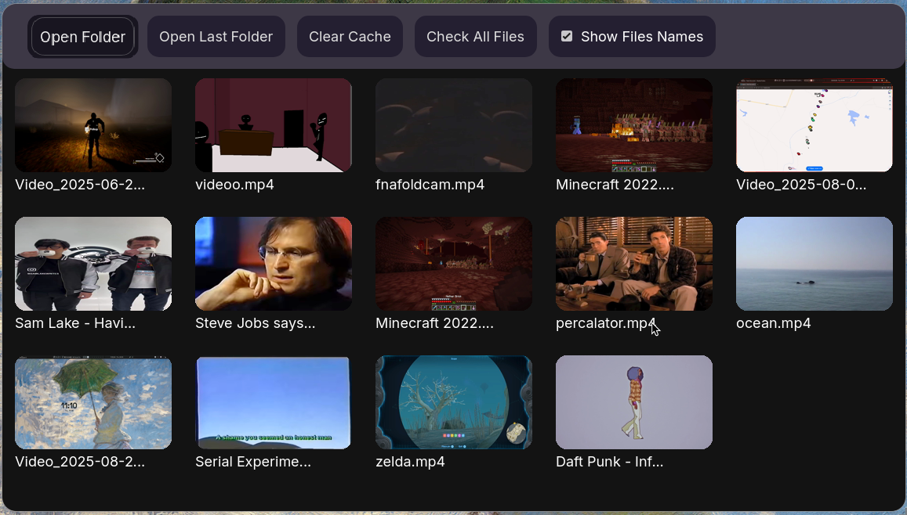

# godot simple video gallery
A simple video gallery made with godot engine and ffmpeg 

## Requirements

- Godot Engine 4.5
- ffmpeg

> [!NOTE]
> This is still W.I.P 

### TODO:

- Clear ffmpegUtils.gd code
- Try implement multithreading
- Add config options 

)
